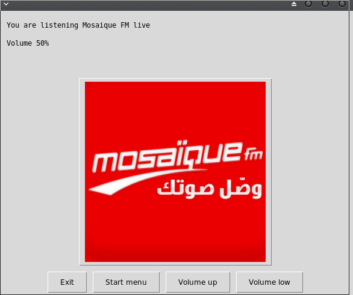

   

# Radio over internet RoIP with GUI


## What's this software ?  

This Python 3 software stream some radio stations from internet.





## What you need to make it work :  

The last version of Python 3.

you also need to have the easygui library for python 3:

At least the version 0.98

```sh
sudo python3 -m pip install --upgrade easygui 
```

You need to have the VLC player installed in you system 

https://www.videolan.org/vlc/index.fr.html

You need to install the vlc module for python 3

```sh
sudo pip3 install python-vlc
```

## How to launch this game :  

```sh
python3 radio.py
```  


## Developer - Author

Hamdy Abou El Anein

## Homepage

http://www.daylightlinux.ch 
