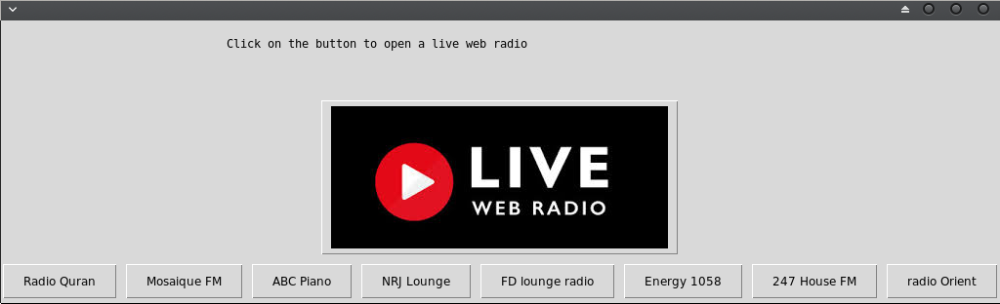

   

# Radio over internet RoIP with GUI





## What's this software ?  

This Python 3 software stream some radio stations from internet.


## What you need to make it work :  

Please change all the pictures path to your own : path="/home/hamdy/Documents/Radio-Streaming-Gui-Original/pictures/"

The last version of Python 3.

you also need to have the easygui library for python 3:

At least the version 0.98

```sh
sudo python3 -m pip install --upgrade easygui 
```

You need to have the VLC player installed in you system 

https://www.videolan.org/vlc/index.fr.html

You need to install the vlc module for python 3

```sh
sudo pip3 install python-vlc
```

## How to launch this software :  

```sh
python3 radio
```  

## Requirements :

If you miss a module, install it pip install module-name. If you miss PIL to have the pictures install pillow with pip.

You need to have the original VLC software installed on your computer.

Be carefull to install "pip install python-vlc" and not "pip install vlc"


## Developer - Author


Hamdy Abou El Anein

## Homepage

http://www.daylightlinux.ch 
